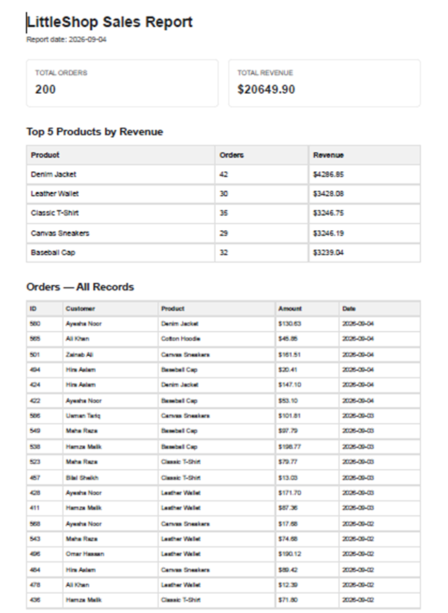

# PDF Report Generator

A backend service that turns SQLite data into a real PDF report.

The project demonstrates a complete data-to-document pipeline:

```text
SQLite data
    ↓
SQL aggregation
    ↓
Report object
    ↓
HTML template
    ↓
Playwright / Chromium
    ↓
PDF file
    ↓
API file link
```

The API generates the PDF, stores it on disk, records its metadata in SQLite, and returns a link that can be used to download the report.

## Tech Stack

- Node.js 22+
- Express
- SQLite using Node's built-in `node:sqlite`
- Playwright
- Chromium
- HTML/CSS for the report template

No external database server is required.

---

## Dataset

This project uses **Option A — The LittleShop dataset** from the assignment.

The seed script creates a SQLite database called:

```text
report.db
```

with an `orders` table:

```sql
CREATE TABLE orders (
    id INTEGER PRIMARY KEY AUTOINCREMENT,
    customer TEXT NOT NULL,
    product TEXT NOT NULL,
    amount REAL NOT NULL,
    created_at TEXT NOT NULL
);
```

The seed script generates:

- 200 orders
- 5–6 different products
- Random customers
- Random order amounts between 5 and 200
- Random dates from the last 30 days

The seed script deletes the existing orders before inserting new ones, so running it multiple times does not continually increase the number of rows.

---

## Project Structure

```text
pdf-report-generator/
├── src/
│   ├── database.js
│   ├── generatePdf.js
│   ├── reportData.js
│   ├── reportRepository.js
│   ├── reportTemplate.js
│   └── server.js
│
├── scripts/
│   ├── seed.js
│   ├── check-db.js
│   ├── test-report-data.js
│   └── generate-test-pdf.js
│
├── .gitignore
├── package.json
├── package-lock.json
└── README.md
```

Generated files are intentionally excluded from Git:

```text
report.db
reports/
node_modules/
.env
```

---

# Setup

## 1. Clone the repository

```bash
git clone <YOUR-GITHUB-REPOSITORY-URL>
cd pdf-report-generator
```

## 2. Install dependencies

```bash
npm install
```

## 3. Install Chromium

Playwright requires a browser installation for PDF generation:

```bash
npx playwright install chromium
```

---

# Seed the Database

Run:

```bash
npm run seed
```

Expected output:

```text
Seed complete: 200 orders inserted.
```

You can verify the database:

```bash
npm run check-db
```

The order count should be:

```text
Order count: 200
```

Running the seed script again should still leave exactly 200 orders.

---

# Run the API

Start the server:

```bash
npm start
```

The API will run at:

```text
http://localhost:3000
```

Test the health endpoint:

```bash
curl -i http://localhost:3000/health
```

Expected response:

```http
HTTP/1.1 200 OK
```

```json
{
  "status": "ok"
}
```

---

# Generate a Report

Create a report with:

```bash
curl -i -X POST http://localhost:3000/reports
```

The endpoint performs the complete pipeline:

```text
query database
    ↓
build report data
    ↓
build HTML
    ↓
render HTML with Chromium
    ↓
save PDF to reports/<id>.pdf
    ↓
save report metadata
    ↓
return file link
```

Example response:

```json
{
  "id": 1,
  "file": "/reports/1/file"
}
```

The response uses HTTP `201 Created` when a new report is generated.

---

# Download the PDF

Once the API returns an ID, download the PDF using:

```bash
curl -o my-report.pdf http://localhost:3000/reports/1/file
```

Replace `1` with the ID returned by your API.

The resulting file is a real PDF that can be opened in a PDF viewer.

The JSON API responses contain report metadata and links rather than PDF bytes. The PDF itself is served through:

```text
GET /reports/:id/file
```

This follows a **store-and-link** approach: the generated artifact is stored once and clients receive an address to retrieve it.

---

# API Reference

## GET `/health`

Checks whether the server is running.

### Response

```json
{
  "status": "ok"
}
```

Status:

```text
200 OK
```

---

## POST `/reports`

Generates a PDF report.

### Request

```http
POST /reports
```

No request body is required.

### New report response

Status:

```text
201 Created
```

Example:

```json
{
  "id": 1,
  "file": "/reports/1/file"
}
```

---

## POST `/reports` with `force`

To generate a new report even when today's report already exists:

```bash
curl -i -X POST http://localhost:3000/reports \
  -H "Content-Type: application/json" \
  -d "{\"force\":true}"
```

This bypasses the once-per-day duplicate check and creates a new report.

---

## GET `/reports/:id`

Returns metadata about a generated report.

Example:

```bash
curl http://localhost:3000/reports/1
```

Example response:

```json
{
  "id": 1,
  "path": "reports/1.pdf",
  "created_at": "2026-09-04T10:30:00.000Z",
  "file": "/reports/1/file"
}
```

An unknown report ID returns:

```http
404 Not Found
```

---

## GET `/reports/:id/file`

Serves the generated PDF.

Example:

```bash
curl -o report.pdf http://localhost:3000/reports/1/file
```

This endpoint returns the PDF file rather than JSON.

---

# Aggregation SQL

The report is generated from four main SQL aggregations.

## 1. Total number of orders

```sql
SELECT COUNT(*) AS total_orders
FROM orders;
```

## 2. Total revenue

```sql
SELECT ROUND(SUM(amount), 2) AS total_revenue
FROM orders;
```

## 3. Top 5 products by revenue

```sql
SELECT
    product,
    COUNT(*) AS order_count,
    ROUND(SUM(amount), 2) AS revenue
FROM orders
GROUP BY product
ORDER BY revenue DESC
LIMIT 5;
```

## 4. Orders per day for the last 7 days

```sql
SELECT
    created_at,
    COUNT(*) AS order_count
FROM orders
WHERE created_at >= date('now', '-6 days')
GROUP BY created_at
ORDER BY created_at ASC;
```

These queries are combined by `getReportData()` into a single report object.

---

# PDF Rendering

The report is first constructed as an HTML document.

The HTML contains:

- Report title
- Report date
- Total orders
- Total revenue
- Top 5 products table
- Full orders table

Playwright launches Chromium and prints the HTML to an A4 PDF.

The important rendering step is:

```javascript
await page.pdf({
  path: outputPath,
  format: "A4",
  printBackground: true,
});
```

The long orders table intentionally spans multiple pages.

Print CSS prevents rows from being split across pages:

```css
tr {
  break-inside: avoid;
  page-break-inside: avoid;
}
```

The table headers are placed inside `<thead>` so that the browser can repeat them when the table continues onto another page.

---

# Stage 4 — Generate and Serve by Link

Stage 4 turns the report pipeline into an API.

`POST /reports` runs the query → render → save pipeline and returns the newly generated report ID and file link.

The generated PDF is stored on disk under:

```text
reports/<id>.pdf
```

The database stores the report's ID, file path, and creation time.

`GET /reports/:id` returns metadata and the file link.

`GET /reports/:id/file` serves the actual PDF.

The PDF is therefore stored once and referenced by a link instead of being embedded inside JSON responses.

For this assignment, generating the PDF inside the request is acceptable because the report is relatively small. For a much larger report or higher traffic, I would move the PDF generation into a background job so the API can respond immediately instead of making the user wait for rendering to finish.

---

# Stage 5 — Duplicate Requests

Stage 5 makes report generation idempotent for the same day.

Before generating a new report, `POST /reports` checks whether a completed report already exists for today.

If one exists, the API returns the existing report instead of generating another PDF.

Example:

### First request

```http
POST /reports
```

Response:

```http
201 Created
```

```json
{
  "id": 1,
  "file": "/reports/1/file"
}
```

### Second request

```http
POST /reports
```

Response:

```http
200 OK
```

```json
{
  "id": 1,
  "file": "/reports/1/file"
}
```

Both requests point to the same report.

This protects against accidental duplicate generation, such as a user double-clicking a Generate Report button.

A real-world example of the same problem is sending the same customer email twice: without an idempotency check, a retry or double-click could create duplicate side effects and potentially cost money or damage user trust.

If a fresh report is required, the API accepts:

```json
{
  "force": true
}
```

which bypasses the once-per-day check and creates a new report.

---

# Stage 4 Proof

The Stage 4 flow is:

```bash
curl -i -X POST http://localhost:3000/reports
```

Example:

```json
{
  "id": 1,
  "file": "/reports/1/file"
}
```

Then:

```bash
curl -o my-report.pdf http://localhost:3000/reports/1/file
```

The downloaded file opens as a real PDF.

---

# Stage 5 Proof

Run the report request twice:

```bash
curl -i -X POST http://localhost:3000/reports
```

Then immediately run it again:

```bash
curl -i -X POST http://localhost:3000/reports
```

Both responses should contain the same ID.

Example:

```text
First request:
201 Created
id: 1

Second request:
200 OK
id: 1
```

Only one PDF is generated for that day.

To force a new report:

```bash
curl -i -X POST http://localhost:3000/reports \
  -H "Content-Type: application/json" \
  -d "{\"force\":true}"
```

The forced request should return:

```text
201 Created
```

with a new report ID.

---

# PDF Evidence

A generated report contains multiple pages because the complete order table is intentionally long.

The PDF demonstrates:

- Real SQLite data
- SQL aggregation results
- A4 PDF rendering
- Multiple pages
- Repeating table headers
- Table rows that remain together across page breaks





---

# Git History

The project was built incrementally through the assignment stages.

Expected meaningful commits:

```text
Stage 0: setup ready
Stage 1: seeded report.db
Stage 2: aggregation queries
Stage 3: HTML to PDF with clean page breaks
Stage 4: generate and serve by link
Stage 5: duplicate requests make one report
Stage 6: publish and docs
```

Check the history with:

```bash
git log --oneline
```

---

# Reproducibility

A clean-machine workflow is:

```bash
git clone <YOUR-GITHUB-REPOSITORY-URL>
cd pdf-report-generator
npm install
npx playwright install chromium
npm run seed
npm start
```

Then, in another terminal:

```bash
curl -i -X POST http://localhost:3000/reports
```

Copy the returned report ID and download it:

```bash
curl -o report.pdf http://localhost:3000/reports/<ID>/file
```

The generated PDF should contain the seeded LittleShop data and be at least two pages long.

---

# What This Project Demonstrates

This project demonstrates several backend concepts working together:

- SQLite database design
- Seed data generation
- SQL aggregation
- `COUNT`, `SUM`, and `GROUP BY`
- Express API endpoints
- HTML templating
- Headless browser automation
- PDF generation
- File storage
- File-serving endpoints
- HTTP status codes
- Idempotent API behavior
- Reproducible development workflows
- Git and GitHub publishing

The core lesson is the complete pipeline:

```text
Data → Query → Render → Store → Link
```

That same pattern can be extended to invoices, financial statements, analytics exports, certificates, and other generated documents.
